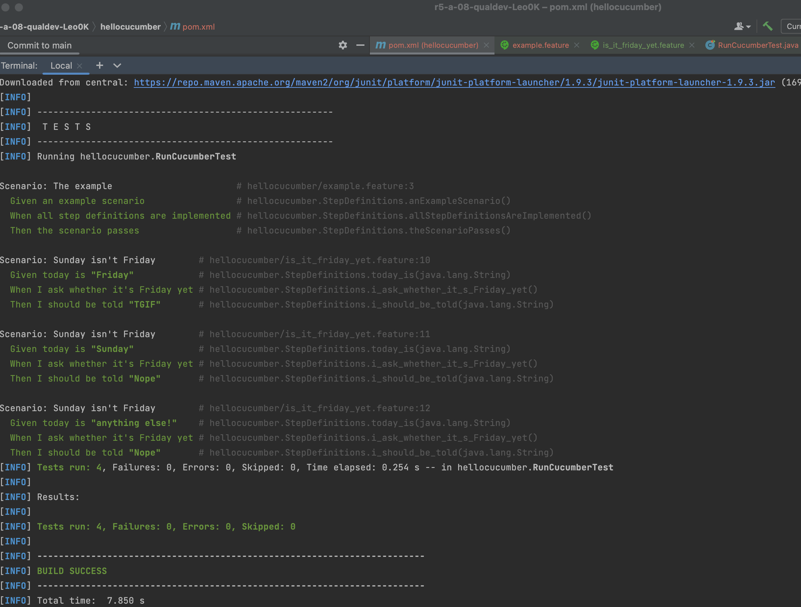
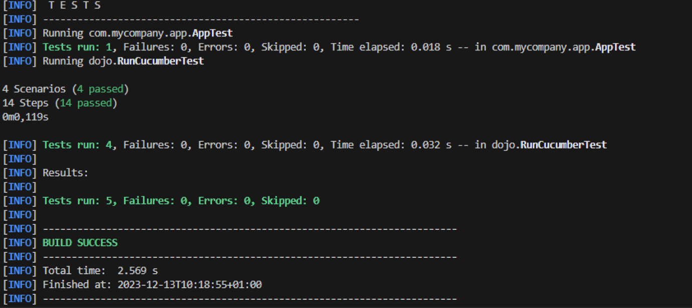
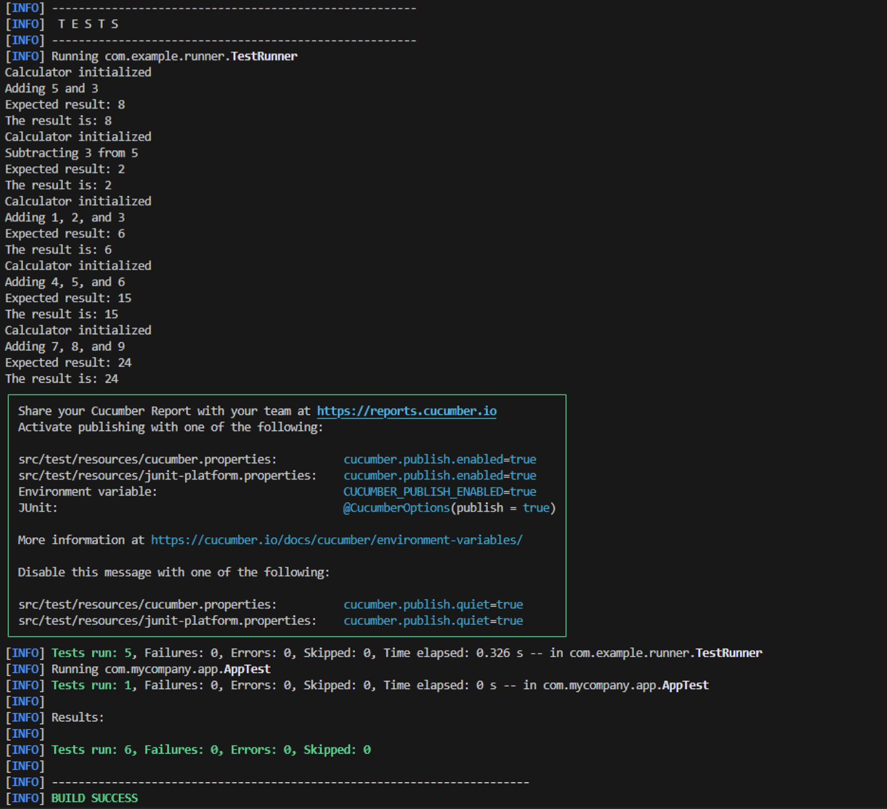

:toc:
Ce dépôt concerne les rendus de mailto:leonidas.kosmidis-teuschl@etu.univ-tlse2.fr[Leonidas Kosmidis].

== TP1

.Code
[source,gherkin]
----
Feature: Is it Friday yet?
  Everybody wants to know when it's Friday

  Scenario: Sunday isn't Friday
    Given today is "<day>"
    When I ask whether it's Friday yet
    Then I should be told "<answer>"
    Examples:
      | day            | answer |
      | Friday         | TGIF   |
      | Sunday         | Nope   |
      | anything else! | Nope   |
----

== Résultats des tests TP1:

.Tests success

include::hellocucumber/report0.txt[]

== TP2

.Code
[source,gherkin]
----
Feature: Cocktail Ordering

  As Romeo, I want to offer a drink to Juliette so that we can discuss together (and maybe more).

  Scenario Outline: Creating an empty order
    Given <from> who wants to buy a drink
    When an order is declared for <to>
    Then there is <nbCocktails> cocktails in the order

    Examples:
      | from  | to       | nbCocktails |
      | Romeo | Juliette |           0 |
      | Tom   | Jerry    |           0 |

  Scenario Outline: Sending a message with an order
    Given <from> who wants to buy a drink
    When an order is declared for <to>
    And a message saying "<message>" is added
    Then the ticket must say "<expected>"

    Examples:
      | from  | to       | message     | expected                                    |
      | Romeo | Juliette | Wanna chat? | Message from Romeo to Juliette: Wanna chat? |
      | Tom   | Jerry    | Hei!        | Message from Tom to Jerry: Hei!             |
----

== Résultats des tests TP2:

.Tests success TP2

include::cucumber_demo/report1.txt[]

== TP3

.Code
[source,java]
----

package com.example.steps;

import com.example.Calculator;
import io.cucumber.java.en.Given;
import io.cucumber.java.en.Then;
import io.cucumber.java.en.When;
import static org.junit.Assert.assertEquals;

public class CalculatorStepDefinitions {
    private Calculator calculator;
    private int result;

    @Given("I have a calculator")
    public void i_have_a_calculator() {
        calculator = new Calculator();
        System.out.println("Calculator initialized");
    }

    @When("I add {int} and {int}")
    public void i_add_and(int a, int b) {
        result = calculator.add(a, b);
        System.out.println("Adding " + a + " and " + b);
    }

    @When("I subtract {int} from {int}")
    public void i_subtract_from(int a, int b) {
        result = calculator.subtract(b, a);
        System.out.println("Subtracting " + a + " from " + b);
    }

    @When("I add {int}, {int}, and {int}")
    public void i_add_multiple_numbers(int a, int b, int c) {
        result = calculator.add(a, calculator.add(b, c));
        System.out.println("Adding " + a + ", " + b + ", and " + c);
    }

    @Then("the result should be {int}")
    public void the_result_should_be(int expectedResult) {
        assertEquals(expectedResult, result);
        System.out.println("Expected result: " + expectedResult);
    }

    @Then("I print the result to the terminal")
    public void i_print_the_result_to_the_terminal() {
        System.out.println("The result is: " + result);
    }
}
----

.Code
[source,gherkin]
----
Feature: Calculator operations

  Scenario: Add two numbers
    Given I have a calculator
    When I add 5 and 3
    Then the result should be 8
    And I print the result to the terminal

  Scenario: Subtract two numbers
    Given I have a calculator
    When I subtract 3 from 5
    Then the result should be 2
    And I print the result to the terminal

  Scenario Outline: Add multiple numbers
    Given I have a calculator
    When I add <number1>, <number2>, and <number3>
    Then the result should be <result>
    And I print the result to the terminal

    Examples:
      | number1 | number2 | number3 | result |
      | 1       | 2       | 3       | 6      |
      | 4       | 5       | 6       | 15     |
      | 7       | 8       | 9       | 24     |
----

== Résultats des tests TP3:

.Tests success TP3

include::tp3_demo/report.txt[]